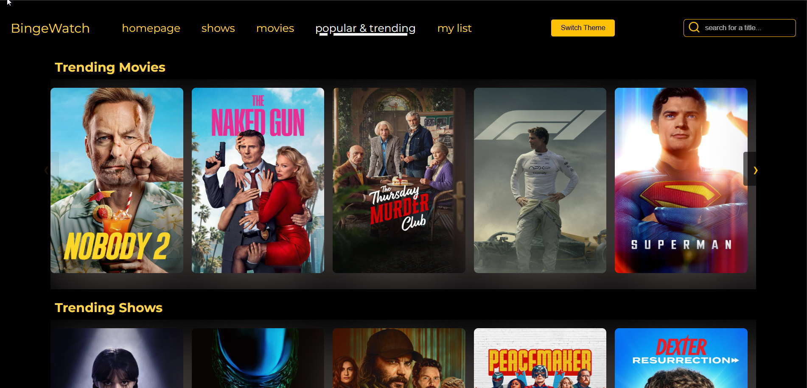

## netflix-create-react-vite-app

> - `React`
> - `Vite`
> - `Typescript`
> - `Playwright`
> - `Styled-components`
> - `Framer-motion`
> - `movie-database-api`

## netflix-create-next-app

> - `React`
> - `Next`
> - `Typescript`
> - `Shadcn`
> - `tailwind`
> - `Framer-motion`
> - `movie-database-api`

# Netflix-clone

> - `cd netflix-create-react-vite-app / cd netflix-create-next-app /`
> - `pnpm install`
> - `pnpm dev`
