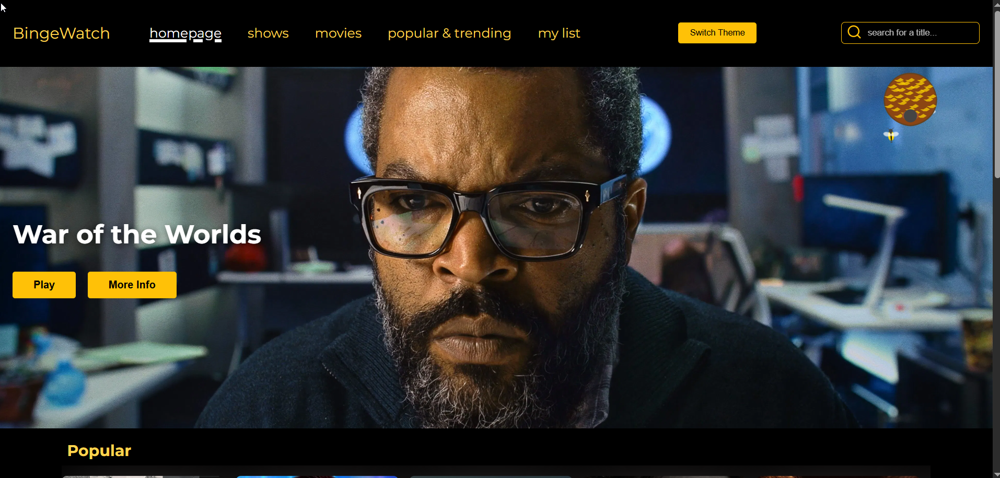
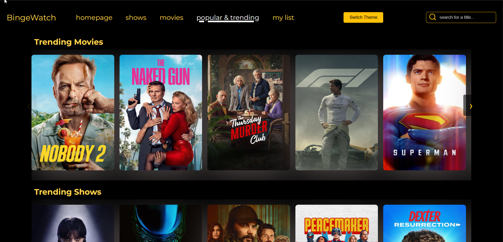

# Netflix Clone

A Netflix clone built with two different React setups — one using **React + Vite** and another using **Next.js**. Both versions fetch movie and TV show data from [The Movie Database (TMDB)](https://www.themoviedb.org/) API.




---

## Prerequisites

- [Node.js](https://nodejs.org/) (v18 or higher recommended)
- [pnpm](https://pnpm.io/) package manager
- A TMDB API key (see below)

---

## Getting a TMDB API Key

Both apps require an API key from [The Movie Database (TMDB)](https://www.themoviedb.org/).

1. Create a free account at [https://www.themoviedb.org/signup](https://www.themoviedb.org/signup)
2. Go to your **Account Settings** → **API**
3. Request an API key and copy the **API Key (v3 auth)**

---

## Project Structure

This monorepo contains two separate apps:

| App | Stack |
|-----|-------|
| `netflix-create-react-vite-app` | React, Vite, TypeScript, TanStack Query, Playwright, Styled Components, Framer Motion |
| `netflix-create-next-app` | React, Next.js, TypeScript, TanStack Query, Shadcn UI, Tailwind CSS, Framer Motion |

---

## Running the React + Vite App

### 1. Create the `.env` file

Navigate to the Vite app folder and create a `.env` file:

```bash
cd netflix-create-react-vite-app
```

Create a `.env` file with the following content:

```env
VITE_API_KEY="your-tmdb-api-key-here"
SKIP_PREFLIGHT_CHECK=true
MY_LIST_ID=""
```

> **Note:** Replace `your-tmdb-api-key-here` with your actual TMDB API key.

### 2. Install dependencies and run

```bash
pnpm install
pnpm dev
```

The app will start at `http://localhost:5173` (or another port if 5173 is in use).

### Available Scripts

| Script | Description |
|--------|-------------|
| `pnpm dev` | Start the development server |
| `pnpm build` | Build for production |
| `pnpm preview` | Preview the production build locally |
| `pnpm test:e2e` | Run Playwright end-to-end tests |
| `pnpm test:e2e:ui` | Run Playwright tests with UI |
| `pnpm format` | Format code with Ultracite |

---

## Running the Next.js App

### 1. Create the `.env.local` file

Navigate to the Next.js app folder and create a `.env.local` file:

```bash
cd netflix-create-next-app
```

Create a `.env.local` file with the following content:

```env
NEXT_PUBLIC_API_KEY="your-tmdb-api-key-here"
```

> **Note:** Replace `your-tmdb-api-key-here` with your actual TMDB API key.

### 2. Install dependencies and run

```bash
pnpm install
pnpm dev
```

The app will start at `http://localhost:3000` (or another port if 3000 is in use).

### Available Scripts

| Script | Description |
|--------|-------------|
| `pnpm dev` | Start the development server |
| `pnpm build` | Build for production |
| `pnpm start` | Start the production server |
| `pnpm lint` | Run ESLint |
| `pnpm type-check` | Run TypeScript type checking |

---

## Tech Stack Summary

### netflix-create-react-vite-app

- `React`
- `Vite`
- `TypeScript`
- `TanStack/react-query`
- `Playwright`
- `Styled-components`
- `Framer-motion`
- `TMDB API`

### netflix-create-next-app

- `React`
- `Next.js`
- `TypeScript`
- `TanStack/react-query`
- `Shadcn UI`
- `Tailwind CSS`
- `Framer-motion`
- `TMDB API`

---

## License

This project is for educational purposes only.
